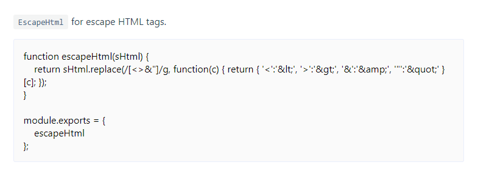

# vuepress-plugin-import-code

> Vuepress plugin for import code with [markdown-it-container](https://github.com/markdown-it/markdown-it-container).

## Install

```
yarn add vuepress-plugin-import-code -D
```

You need install [`vuepress 1.x`](https://vuepress.vuejs.org/) first.

## Usage

Use `vuepress-plugin-import-code` in `config.js`.

```js
module.exports = {
    plugins: [
        'vuepress-plugin-import-code'
    ]
}
```

You may need some style in `.vuepress/styles/index.styl`.

```
.markdown-import-code__content {
    color: #000;
    padding: 1rem;
    box-sizing: border-box;
    border: 1px solid #eaeefb;
    border-radius: 3px;
    background-color: #fafafa;
}
```

Now you can use it as blow.

```
::: code /docs/.vuepress/util.js
`EscapeHtml` for escape HTML tags.
:::
```

You will got this.



## Buy me coffee


For a detailed explanation on how things work, contact me <www.389055604@qq.com>.